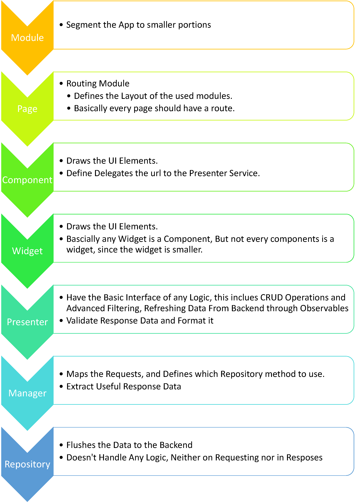
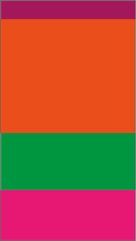

# Before and After: Code Refactoring


## Case Study: Comments Component


### Before: 

```typescript
private fetchAllComments() {
    this.allComments = this.commentsService.getAllComments(this.activatedRoute.snapshot.paramMap.get('id'),
        this.pageType).subscribe(
        data => {
          this.comments = data.Data.reverse();
          console.log('response: ', this.comments);
        }, error1 => {
          console.log(error1);
        }
    );
  }

  // prevent enter default
  onKeydown(event) {
    event.preventDefault();
  }

  // adding comment
  pressing(textareaValue: NgModel) {
    if (textareaValue.valid) {
      this.errorMessage = '';
      this.isSubmitted = false;
      this.commentsService.postComment(
          this.pageType,
          this.activatedRoute.snapshot.paramMap.get('id'),
          textareaValue.value,
          this.client.id).subscribe(
          (data) => {
                console.log('response Adding : ', data);
                textareaValue.reset();
                this.isSubmitted = false;
                this.fetchAllComments();
              },
          error => {
              this.isSubmitted = false;
              console.log(error);
          }
      );
    } else {
      this.errorMessage = 'Comment Can Not By Empty';
    }
  }

  editComment(index: number) {
    if (this.client) {
      this.edit = +index;
    } else {
      console.log('user is not login, FALSE');
      return false;
    }
  }

  saveComment(editTextareaValue: NgModel, index: number) {
    if (editTextareaValue.valid) {
      this.errorMessage = '';
      this.buttonValue = 'Saving...';
      this.commentsService.updateComment(
          this.comments[index].id,
          this.pageType,
          this.activatedRoute.snapshot.paramMap.get('id'),
          this.comments[index].body,
          this.client.id
      ).subscribe(
          () => {
            this.edit = -1;
            this.buttonValue = 'Save';
            this.toaster.success('Comment Updated Successfully');
          },
          error => {
            console.log(error);
          }
      );
    } else {
      this.errorEditMessage  = 'Comment Can Not By Empty';
    }
  }

  deleteComment(commentId: number) {
    if (confirm('Are You Sure You Want To Delete This Comment')) {
      this.commentsService.deleteComment(commentId).subscribe(
          () => {
            this.fetchAllComments();
            this.toaster.success('Comment Deleted Successfully');
          },
          error => {
            console.log(error);
          }
      );
    } else {
      return false;
    }
  }
}
```

### After:

1. Comment List:

```typescript

  private fetchAllComments() {
    this.commentPresenter.getListObservable().subscribe(
      commentList => {
        this.comments = commentList;
      }, error1 => {
        console.log(error1);
      }
    );
    this.commentPresenter.getComments();
  }

  saveComment() {
    if (this.commentForm.get('commentText').value !== null || this.commentForm.get('commentText').value !== undefined) {
      this.commentPresenter.createComment(this.commentForm.get('commentText').value);
    } else {
      this.errorMessage = 'Empty Comment!';
    }
  }
```

2. Comment Item:

```typescript

  saveComment() {
    this.commentPresenter.updateComments(this.comment, this.commentForm.get('commentText').value);
  }

  deleteComment() {
    this.commentPresenter.deleteComment(this.comment);
  }

  disableEditMode() {
    this.editMode = false;
  }

  enableEditMode() {
    this.editMode = true;
  }
```

## Architecture Behind the Change:



This Allows For Flexibility and Easy Replacement of any UI Element, especially if we have widgets custom designed for Mobile: if we see the following Desktop Example:


No Consider we want a new header for the mobile, Not responsive but brand new.



 now we don't need to copy all the logic from `desktop-header.ts` to the new `mobile-header.ts` rather we use the same Façade in the `desktop-header.ts` namely `header.presenter.service.ts` and plug it in the class and voila, same Functions Same Behavior Minimal Refactoring and Migration added.